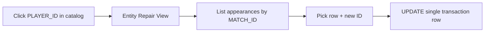

# إصلاح IDs لكل مباراة (لاعبين ومدربين)

## السياق والمشكلة

دمج الأسماء في [`app/DBManagement/db_management_service.js`](app/DBManagement/db_management_service.js) يحدّث المراجع **بالاسم** (`targetName`) بينما الجداول التشغيلية تخزّن غالباً **IDs** (`P-0490`, `M-0012`) عبر `resolveCatalogFieldsInForm`. النتيجة:

- دمج شخصين مختلفين يخلط كل ظهوراتهم تحت ID واحد.
- لا توجد أداة عكسية لنقل صفوف محددة لمباراة معينة إلى ID صحيح.

**الهدف الجديد (حسب توضيحك):** تغيير ID لاعب/مدرب **في مباراة معينة** — سواء في التشكيلة، تفاصيل اللاعب، أو حقول المدرب في تفاصيل المباراة.



---

## النطاق

| يشمل | لا يشمل (مرحلة لاحقة) |
|------|------------------------|
| `db_PLAYERS` + `db_MANAGERS` فقط | حكام، فرق، ملاعب |
| صفوف مرتبطة بـ `MATCH_ID` | `egy_NT_SQUAD` بدون مباراة (يمكن إضافته لاحقاً) |
| تعديل ID في صف موجود | إنشاء مباراة جديدة أو حذف صفوف |

### جداول اللاعب (أعمدة تحتوي ID اللاعب)

| الجدول | الأعمدة |
|--------|---------|
| `alahly_LINEUPDETAILS` / `egy_NT_LINEUPDETAILS` | `PLAYER NAME`, `PLAYER NAME OUT` |
| `alahly_PLAYERDETAILS` / `egy_NT_PLAYERDETAILS` | `PLAYER NAME` |
| `alahly_GKSDETAILS` / `egy_NT_GKSDETAILS` | `PLAYER NAME` |
| `alahly_PKS` / `egy_NT_PKS` | `AHLY PLAYER`/`Egypt PLAYER`, `OPPONENT PLAYER`, `AHLY GK`/`EGYPT GK`, `OPPONENT GK` |

### جداول المدرب

| الجدول | الأعمدة |
|--------|---------|
| `alahly_MATCHDETAILS` | `AHLY MANAGER`, `OPPONENT MANAGER` |
| `egy_NT_MATCHDETAILS` | `EGYPT MANAGER`, `OPPONENT MANAGER` |

(نفس القائمة المستخدمة في `mergeEntities` — مصدر واحد للحقيقة.)

---

## التصميم

### 1. واجهة: تاب Repair بدل/بجانب الإحصائيات

في [`app/DBManagement/page.js`](app/DBManagement/page.js):

- عند الضغط على `PLAYER_ID` / `MANAGER_ID` في `db_PLAYERS` أو `db_MANAGERS` فقط → فتح **عرض كامل** (ليس مودال صغير فقط).
- حالة جديدة: `repairEntity = { id, row, table }` + `catalogView = 'repair'`.
- زر رجوع للكتالوج.

**ملفات UI جديدة:**

- [`app/DBManagement/EntityRepair/EntityRepairView.js`](app/DBManagement/EntityRepair/EntityRepairView.js) — الحاوية الرئيسية
- [`app/DBManagement/EntityRepair/EntityAppearanceTable.js`](app/DBManagement/EntityRepair/EntityAppearanceTable.js) — جدول الظهورات
- [`app/DBManagement/EntityRepair/ReassignIdModal.js`](app/DBManagement/EntityRepair/ReassignIdModal.js) — اختيار ID جديد (Autocomplete من الكتالوج)

**أعمدة الجدول:**

- التاريخ | `MATCH_ID` | المصدر (Lineup / Player Details / …) | العمود | الفريق (إن وُجد) | `ROW_ID` | زر **Change ID**

فلترة: بحث بـ `MATCH_ID`، نطاق تاريخ، مصدر الجدول.

### 2. Backend: RPC لجلب الظهورات

ملف migration جديد: `supabase/migrations/..._entity_match_appearances.sql`

```sql
get_entity_match_appearances(p_catalog_table text, p_entity_id text)
RETURNS jsonb  -- { appearances: [ { source_table, source_label, row_id, match_id, match_date, field_column, team_name, current_value } ] }
```

- يمر على نفس جداول `get_entity_timeline_and_tables` لكن **صف بصف** مع `ROW_ID` و`MATCH_ID`.
- يربط بجدول المباراة للحصول على `DATE`.
- للمدرب: `match_id` = `ROW_ID` من `MATCHDETAILS` (صف المباراة نفسه).
- يرتب حسب التاريخ تنازلياً.

### 3. Service: إعادة تعيين ID

في [`app/DBManagement/entity_repair_service.js`](app/DBManagement/entity_repair_service.js):

```javascript
reassignEntityField({ sourceTable, rowId, fieldColumn, newEntityId })
```

- يتحقق أن `sourceTable` + `fieldColumn` في القائمة المسموحة (whitelist).
- `update` على `ROW_ID` مع القيمة الجديدة (ID وليس اسم).
- يستدعي `loadCaches()` بعد الحفظ (أو invalidate catalog cache).

**اختياري — إعادة تعيين كل ظهورات مباراة واحدة:**

```javascript
reassignEntityInMatch({ entityId, matchId, newEntityId, catalogTable })
```

يحدّث كل الصفوف التي تحتوي `entityId` في نفس `MATCH_ID` عبر كل الجداول المسموحة (مفيد بعد دمج غلط لكل المباراة).

### 4. ربط مع الإحصائيات الحالية

[`EntityStatsModal.js`](app/DBManagement/Modals/EntityStatsModal.js) يبقى ملخصاً سريعاً، أو يُستبدل بزر **"Open Repair View"** للاعبين/المدربين فقط.

---

## تدفق المستخدم (إصلاح دمج غلط)

1. تفتح `db_PLAYERS` → تضغط على `P-0123`.
2. تظهر قائمة: مثلاً مباراة 2018 في Lineup + Player Details، مباراة 2022 في Lineup فقط.
3. تكتشف أن ظهور 2018 ليس لهذا اللاعب.
4. تضغط **Change ID** → تختار `P-0456` من autocomplete.
5. يُحدَّث الصف في `egy_NT_LINEUPDETAILS` فقط (أو كل صفوف نفس المباراة إذا اخترت "Apply to whole match").

---

## تحسين مهم (مرحلة 2 — يُنصح به)

إصلاح [`mergeEntities`](app/DBManagement/db_management_service.js) ليعمل بـ **survivor ID** بدل الاسم:

```javascript
// بدل: .update({ "PLAYER NAME": targetName }).in('PLAYER NAME', sources)
// استخدم: .update({ "PLAYER NAME": survivorId }).in('PLAYER NAME', sourceIds)
```

حيث `sourceIds` = كل `PLAYER_ID` المدمجة. هذا يمنع تكرار المشكلة لكن **لا يُصلح** البيانات القديمة — لذلك تاب الإصلاح ضروري.

---

## الملفات المتأثرة

| ملف | تغيير |
|-----|--------|
| [`app/DBManagement/page.js`](app/DBManagement/page.js) | routing لتاب repair + حالة `repairEntity` |
| `app/DBManagement/EntityRepair/*` | UI جديد |
| `app/DBManagement/entity_repair_service.js` | قراءة/كتابة |
| `supabase/migrations/..._entity_match_appearances.sql` | RPC جلب الظهورات |
| [`app/DBManagement/db_management_service.js`](app/DBManagement/db_management_service.js) | (مرحلة 2) دمج بالـ ID |

---

## التحقق

1. لاعب له ظهور في lineup + player details لنفس `MATCH_ID` → يظهر صفان، كل واحد قابل للتعديل منفصل.
2. تغيير ID في صف واحد → يختفي من قائمة اللاعب القديم ويظهر عند فتح اللاعب الجديد.
3. مدرب في `egy_NT_MATCHDETAILS` → يظهر صف واحد (حقول EGYPT/OPPONENT MANAGER منفصلة إن وُجد الاثنان).
4. محاولة تعديل جدول غير مسموح → رفض من الـ service.
5. `npm run build` بدون أخطاء.
